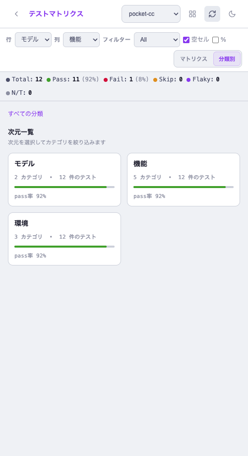
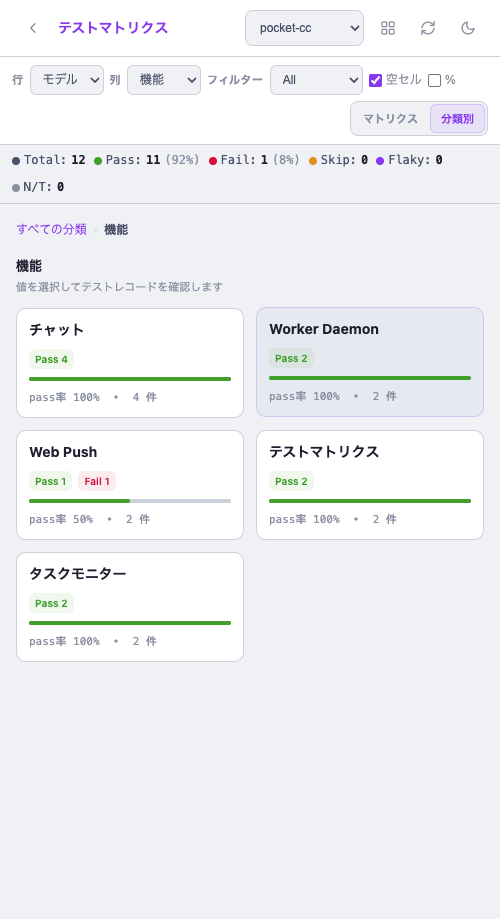
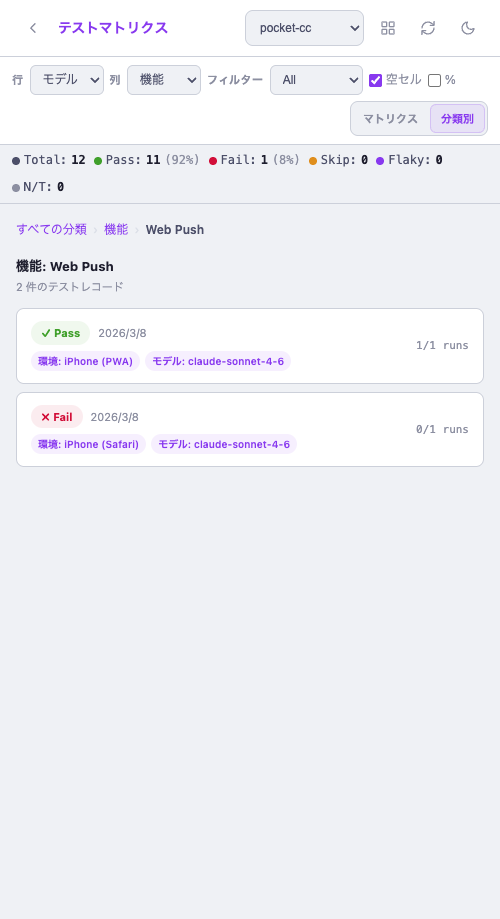

# テストマトリクス 階層的分類ブラウズビュー

- **Issue**: #132 feat/test-matrix-category-browse
- **日付**: 2026-03-08
- **ブランチ**: feat/test-matrix-category-browse
- **プロジェクト**: pocket-cc

## TL;DR

| 項目 | 内容 |
|------|------|
| **課題** | 1000〜10000件規模のテストデータになるとフラットリストでは把握困難 |
| **変更内容** | テストマトリクスに「分類別」ビューを追加（次元→値→レコードの3段階ドリルダウン） |
| **影響範囲** | test-matrix.html のみ。既存のマトリクスビュー・CRUD機能は変更なし |
| **リスク** | Low — 既存APIは変更なし、新規UIロジックのみ追加 |
| **切り戻し** | PR #132 をリバート、または `feat/test-matrix-category-browse` ブランチを削除 |

## 要件マッピング

| Req ID | 要件 | Status | Evidence |
|--------|------|--------|----------|
| REQ-1 | 機能別・画面別など大分類から選択できる | Done | Step1スクリーンショット：次元カード表示 |
| REQ-2 | 大分類内のテストパターン一覧を確認できる | Done | Step3スクリーンショット：レコードリスト |
| REQ-3 | 大分類 → 値カード → レコードの順でドリルダウン | Done | Step1→2→3のフロー確認 |
| REQ-4 | ブレッドクラムで上位に戻れる | Done | 「すべての分類 › 機能 › Web Push」表示確認 |

## 変更内容

### 変更ファイル
| ファイル | 変更種別 | 概要 |
|---------|---------|------|
| `src/web/public/test-matrix.html` | 修正 | ブラウズビューCSS・HTML・JS追加（約200行） |

### 設計判断
| 判断 | 代替案 | 理由 | トレードオフ |
|------|--------|------|------------|
| 既存 records/dimensions データをクライアント側で集計 | 専用API追加 | 既にデータ全量取得済み。APIコール増加なし | 件数増加時に集計コストがフロント側に乗る |
| ビューモードトグル（マトリクス/分類別）で共存 | 別ページ | 既存ユーザーの操作フローを壊さない | コントロールバーが若干複雑になる |
| 3段階固定の階層（次元→値→レコード） | 任意深さのツリー | シンプルで把握しやすい。テストマトリクスの構造に合致 | 4次元以上での「値×値」の組合せ閲覧はできない |

## Before / After

### マトリクスビュー（変更なし、基準として掲載）
| Before（フラットカード） | After（マトリクス + 分類別トグル追加） |
|--------|-------|
|  |  |

### 分類別ビュー（新機能）
| Step 1: 次元一覧 | Step 2: 値カード | Step 3: レコード一覧 |
|--------|--------|-------|
|  |  |  |

## テスト

### 手動テスト
| シナリオ | 手順 | 期待結果 | 実際の結果 | 判定 |
|---------|------|---------|-----------|------|
| 分類別ビュー起動 | 「分類別」ボタンをクリック | 次元カード一覧表示 | 機能/環境/モデルカードが表示 | OK |
| 次元ドリルダウン | 「機能」カードをクリック | 機能別の値カード表示 | チャット/Worker Daemon/Web Push等が表示 | OK |
| 値ドリルダウン | 「Web Push」カードをクリック | 該当レコード2件表示 | Pass(iPhone PWA) + Fail(iPhone Safari) | OK |
| ブレッドクラム戻り | 「機能」リンクをクリック | 値カード一覧に戻る | 正常に戻れる | OK |
| マトリクス切り替え | 「マトリクス」ボタンをクリック | 2Dグリッドビューに戻る | 正常に切り替わる | OK |
| pass率バー | Web Pushカード確認 | 50%でバーが半分 | 正常に表示 | OK |

### 自動テスト
| テスト種別 | 対象 | 結果 | 件数 |
|-----------|------|------|------|
| ユニットテスト (vitest) | test-matrix.ts | pass | 256 pass（既存、変更なし） |

## リグレッションチェック

- [x] 既存マトリクスビュー（2Dグリッド）: 正常動作確認
- [x] モバイルカードビュー: 正常動作確認
- [x] セル編集ドロワー: Step3からクリックで開くことを確認
- [x] API後方互換性: APIコール変更なし
- [x] サマリーストリップ: 両ビューで表示継続

**影響判定**: 既存処理への影響なし。分類別ビューは完全に新規追加のみ。

## Known Gaps / Follow-ups

- [ ] ビューモード（matrix/browse）をlocalStorageに保存してリロード後も維持 → 次スプリント
- [ ] 分類別ビューでのソート順（pass率順、名前順） → Issue検討
