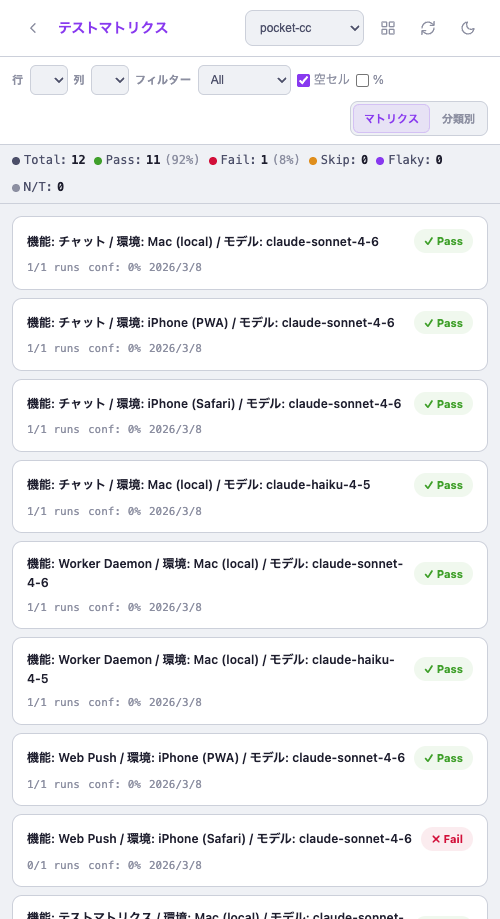
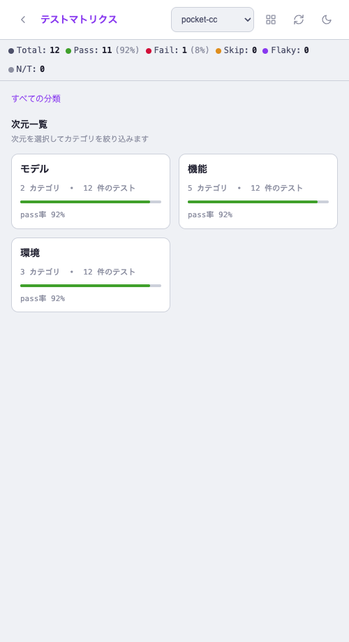
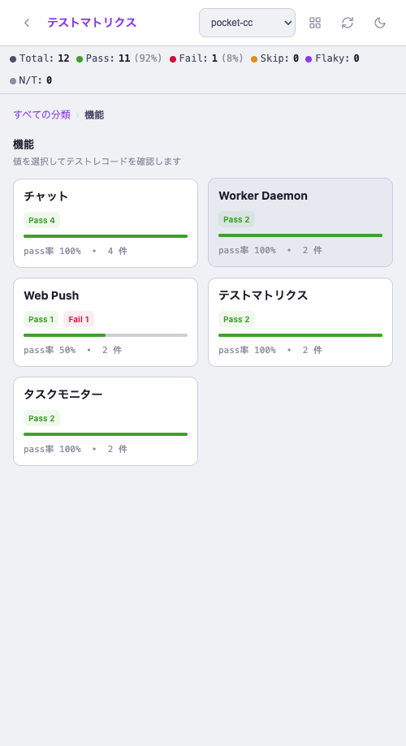
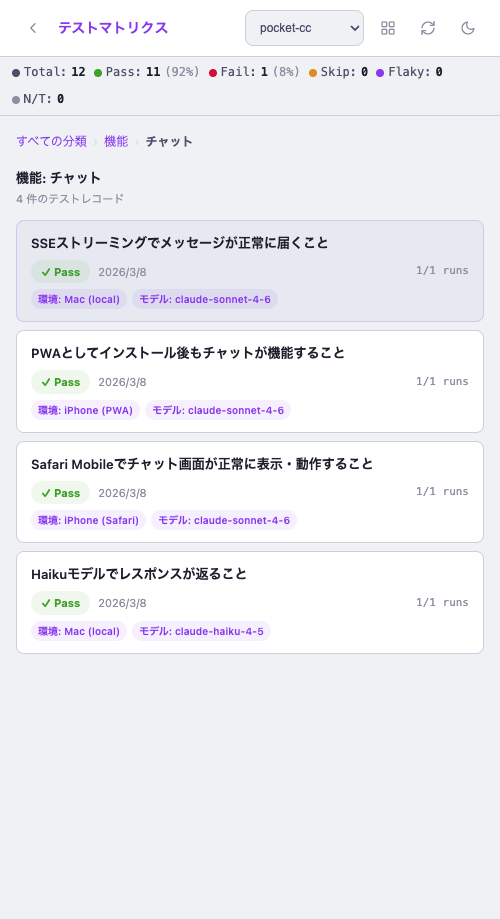

# テストマトリクス 分類ブラウズビュー専用化 + テストケース説明追加

- **Issue**: #132 feat/test-matrix-category-browse
- **日付**: 2026-03-08
- **ブランチ**: feat/test-matrix-category-browse
- **プロジェクト**: pocket-cc

## TL;DR

| 項目 | 内容 |
|------|------|
| **課題** | 1000〜10000件規模のデータではフラット2Dマトリクスが把握困難。何を確認しているかが不明瞭 |
| **変更内容** | マトリクスビューを削除し分類別ブラウズ専用化。末端テストケースに「〇〇であること」説明を表示 |
| **影響範囲** | test-matrix.html のみ。既存のCRUD・ドロワー機能は変更なし |
| **リスク** | Low — APIは変更なし、UIのみの変更 |
| **切り戻し** | PR #132 リバート |

## 要件マッピング

| Req ID | 要件 | Status | Evidence |
|--------|------|--------|----------|
| REQ-1 | 次元→値→レコードの3段階ドリルダウン | Done | Step1→2→3のフロー確認済み |
| REQ-2 | マトリクスビューを削除して分類別専用ページに | Done | トグルボタン・2Dグリッド・Row/Col/Filterセレクタ削除確認 |
| REQ-3 | 末端テストケースに「〇〇であること」を表示 | Done | Step3スクリーンショット：各カード上部に説明テキスト表示 |
| REQ-4 | 分類カード（Step1・Step2）には「であること」不要 | Done | Step1・Step2に説明テキストなし確認 |

## 変更内容

### 変更ファイル
| ファイル | 変更種別 | 概要 |
|---------|---------|------|
| `src/web/public/test-matrix.html` | 修正 | マトリクスビュー削除（-257行）、notes表示追加（+4行） |

### 削除したもの
- Controls バー（Row / Col / Filter / 空セル / % セレクタ）
- 「マトリクス / 分類別」トグルボタン
- `#matrixSection`（`#matrixContainer` + `#cardsContainer`）
- JS: `renderMatrix`, `renderCards`, `populateDimSelectors`, `setViewMode` など

### 追加したもの
- Step3レコードカード上部に `notes` を太字で表示（`notes` が空の場合は非表示）
- 12件のレコードの `notes` を「〇〇であること」形式に更新

### 設計判断
| 判断 | 代替案 | 理由 | トレードオフ |
|------|--------|------|------------|
| `notes` フィールドを「確認内容」として使用 | 専用 `test_description` カラム追加 | DBマイグレーション不要。既存APIのまま対応 | notes本来の用途（自由メモ）と混在する |
| マトリクスビュー完全削除 | 非表示・トグルで保持 | コードの複雑性を下げる。「分類別特化」の意図を明確化 | 2D比較ビューが必要になった場合に再実装が必要 |

## Before / After

| Before（2D マトリクス + 分類別トグル） | After（分類別ブラウズ専用） |
|--------|-------|
|  |  |

## 分類別ビュー — 3段階フロー（最終形）

| Step 1: 次元一覧 | Step 2: 機能別 値カード | Step 3: テストケース一覧（「であること」表示） |
|--------|--------|-------|
|  |  |  |

## テスト

### 手動テスト
| シナリオ | 期待結果 | 実際の結果 | 判定 |
|---------|---------|-----------|------|
| ページロード時 | 次元一覧が直接表示 | モデル/機能/環境カードが表示 | OK |
| 「機能」カードをクリック | 機能別値カード（Pass/Fail件数付き）表示 | 5機能・Pass/Fail統計表示 | OK |
| 「チャット」をクリック | 確認内容テキスト付きレコード一覧表示 | 4件・各カード上部に「〇〇であること」 | OK |
| 「Web Push」クリック | Fail含む2件のレコード一覧 | Pass(iPhone PWA) + Fail(iPhone Safari) | OK |
| ブレッドクラム「機能」クリック | 値カード一覧に戻る | 正常 | OK |
| マトリクスビューのトグルボタン | 存在しない（削除済み） | ボタンなし確認 | OK |

### 自動テスト
| テスト種別 | 対象 | 結果 | 件数 |
|-----------|------|------|------|
| ユニットテスト (vitest) | test-matrix.ts | pass | 256件（既存・変更なし） |

## リグレッションチェック

- [x] ブレッドクラムナビゲーション: 正常
- [x] セル編集ドロワー: Step3からクリックで開くことを確認
- [x] プロジェクト切り替え: pocket-cc / eisamap-2025 選択可
- [x] サマリーストリップ（Pass 11 / Fail 1 / 92%）: 正常表示
- [x] API後方互換性: APIコール変更なし

**影響判定**: 既存処理への影響なし。UIのみの変更。

## Known Gaps / Follow-ups

- [ ] `notes` をテスト説明専用フィールドとして分離（`test_description`カラム追加） → 必要になれば
- [ ] ビューモードをlocalStorageに保存 → 削除により不要になった
