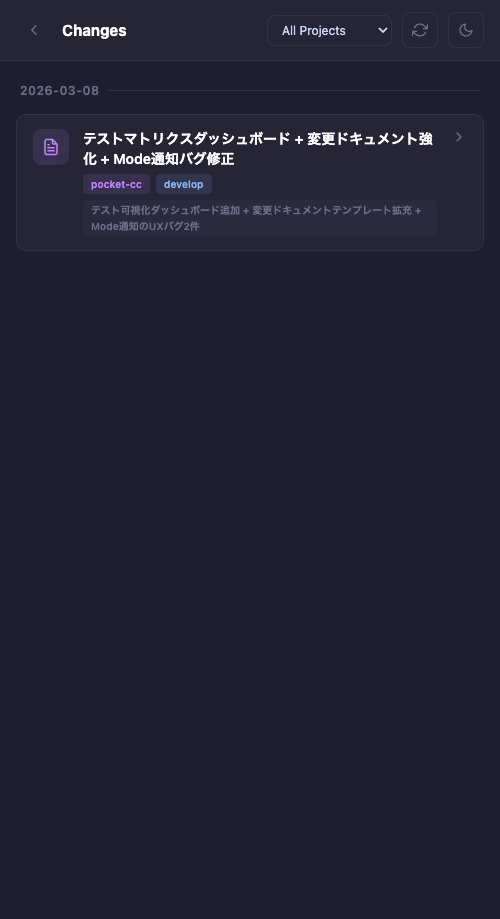
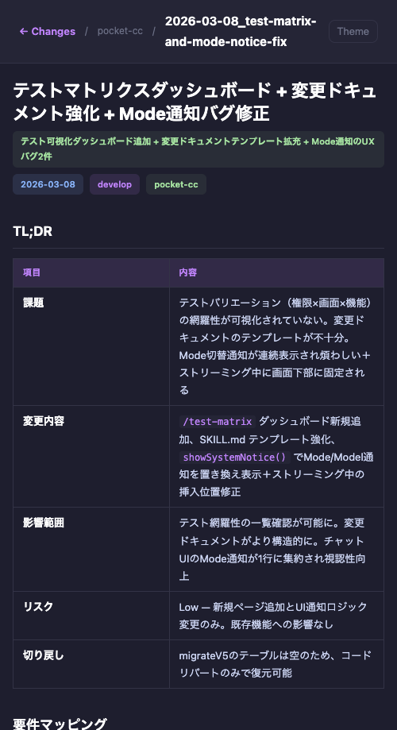
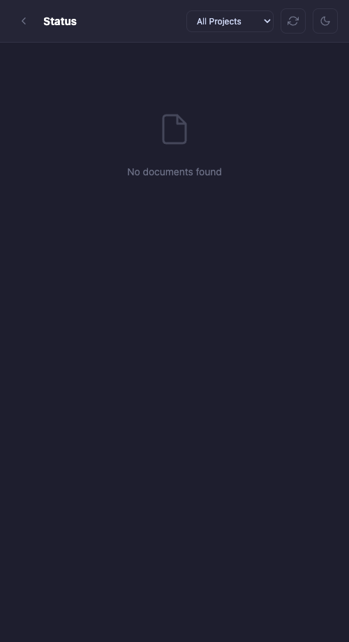
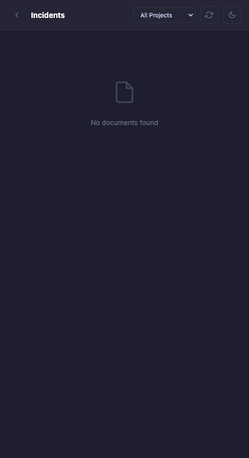

# ドキュメントビューア共通化 + Status/Incidents ページ追加

- **Issue**: changes/status/incidents のドキュメントビューアをDRY化
- **日付**: 2026-03-08
- **ブランチ**: develop
- **プロジェクト**: pocket-cc

## 概要

| 項目 | 内容 |
|------|------|
| **課題** | changes ページの一覧・詳細ロジックが個別実装で、status/incidents を追加するたびにコード重複が発生する |
| **変更内容** | doc-viewer ファクトリ（バックエンド）+ DocViewer 共通コンポーネント（フロントエンド）を作成し、3種類のドキュメントページを統一パターンで提供 |
| **影響範囲** | changes ページのコード大幅削減（changes.ts: 145行→7行）、status/incidents ページが新規利用可能に |
| **リスク** | Low — 既存の changes 機能は動作互換を維持。新規ページ追加のみ |
| **切り戻し** | コードリバートのみで復元可能。DB変更なし |

## 要件マッピング

| Req ID | 要件 | Status | Evidence |
|--------|------|--------|----------|
| REQ-1 | ドキュメント一覧・詳細の共通化 | Done | `doc-viewer.ts` ファクトリ + `doc-viewer.js` 共通コンポーネント |
| REQ-2 | 既存 changes ページの互換維持 | Done | changes 一覧・詳細ともに正常動作（スクリーンショット参照） |
| REQ-3 | Status ページ追加 | Done | `/status` + `/status-report` エンドポイント |
| REQ-4 | Incidents ページ追加 | Done | `/incidents` + `/incident-report` エンドポイント |
| REQ-5 | ナビゲーションリンク追加 | Done | index.html Features メニューに Status / Incidents リンク |

## 変更内容

### 変更ファイル

| ファイル | 変更種別 | 概要 |
|---------|---------|------|
| `src/web/routes/doc-viewer.ts` | 新規 | 汎用ドキュメントビューア API ファクトリ（`createDocRoutes()`） |
| `src/web/public/doc-viewer.js` | 新規 | フロントエンド共通コンポーネント（一覧・詳細・MDレンダラ・TOC・テーマ） |
| `src/web/routes/changes.ts` | 修正 | 145行→7行に簡素化（`createDocRoutes('changes', 'changes')` の1行） |
| `src/web/public/changes.html` | 修正 | `DocViewer.loadList()` 呼び出しに置き換え |
| `src/web/public/change-report.html` | 修正 | `DocViewer.loadDynamic()` 呼び出しに置き換え |
| `src/web/public/status.html` | 新規 | Status 一覧ページ |
| `src/web/public/status-report.html` | 新規 | Status 詳細ページ |
| `src/web/public/incidents.html` | 新規 | Incidents 一覧ページ |
| `src/web/public/incident-report.html` | 新規 | Incidents 詳細ページ |
| `src/web/public/index.html` | 修正 | Features メニューに Status / Incidents リンク追加 |
| `src/web/server.ts` | 修正 | doc-viewer.js 配信 + status/incidents ルート登録 |

### 設計判断

| 判断 | 代替案 | 理由 | トレードオフ |
|------|--------|------|------------|
| バックエンドをファクトリパターンで共通化 | 各ドキュメントタイプごとに個別ルート実装 | `createDocRoutes(type, subdir)` の1行でAPI生成。新規タイプ追加はゼロコード | ファクトリ内部の変更が全タイプに波及する |
| フロントエンドをグローバル DocViewer オブジェクトで共通化 | ES Modules + ビルドツール | ビルドツール不要。HTMLに `<script src="/doc-viewer.js">` + 数行で完結 | モジュールスコープなし、グローバル汚染 |
| MD→HTMLをクライアントサイドで変換 | サーバーサイドで marked.js 等を使用 | APIはraw MDを返し、表示ロジックはフロントに集約。サーバーの依存を増やさない | クライアント負荷、SEO不利（SPAと同じ） |
| 各HTMLページにCSSをインライン記述 | 共通CSSファイルを外部参照 | 各ページが単体で完結。CDNやビルドなしで動作 | CSS重複（各ページに同じスタイル定義） |

## After スクリーンショット

本タスクは新規ページ追加 + リファクタリングのため Before は撮影なし。

### Changes 一覧（doc-viewer 統合後）

### Change Report 詳細（doc-viewer 動的レンダリング）

### Status 一覧（新規）

### Incidents 一覧（新規）

## テスト

### 自動テスト

| テスト種別 | 対象 | 結果 | 件数 |
|-----------|------|------|------|
| ユニットテスト (vitest) | 既存テスト全体 | pass | 153 pass / 153 total |

### 手動テスト

| シナリオ | 手順 | 期待結果 | 実際の結果 | 判定 |
|---------|------|---------|-----------|------|
| Changes 一覧表示 | `/changes` にアクセス | レポート一覧が表示される | 日付グループ化されたカードが表示 | OK |
| Change Report 詳細表示 | 一覧からレポートをクリック | MD内容がHTMLでレンダリングされる | タイトル・メタ・テーブル・チェックリスト全て正常 | OK |
| Status 一覧表示 | `/status` にアクセス | 空状態が表示される | "No documents found" が表示 | OK |
| Incidents 一覧表示 | `/incidents` にアクセス | 空状態が表示される | "No documents found" が表示 | OK |
| 全エンドポイント応答 | 10エンドポイントにcurlでアクセス | 全て200 OK | 全て200 OK | OK |
| API JSON応答 | `/api/changes`, `/api/status`, `/api/incidents` | 正しいJSON | reports配列が返却される | OK |

## リグレッションチェック

- [x] 既存テストスイート: 153 pass / 153 total
- [x] ビルド (`npm run build`): エラーなし
- [x] Changes ページ: 既存レポートが正常に一覧・詳細表示される
- [x] API後方互換性: `/api/changes` のレスポンス形式に変更なし

**影響判定**: 既存処理への影響なし

## Known Gaps / Follow-ups

- [ ] Status / Incidents のドキュメントテンプレート（MDの書き方ガイド）をSKILLとして整備
- [ ] i18n キー（`st.*`, `inc.*`）の追加（現在は英語のみ）
- [ ] CSS の共通化（現在は各HTMLにインライン記述で重複）
